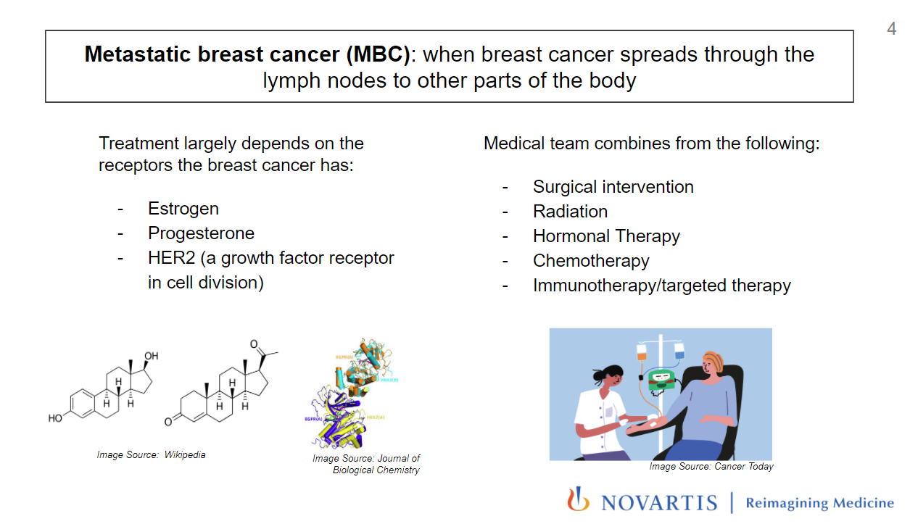

# Novartis-Hackathon

This is the model we built for Novartis Hackathon (2020). 

Novartis Hackathon concerns building model to predict events regarding metastatic breast cancer (MBC) patients. Metastatic breast cancer is breast cancer that has spread to another part of the body, most commonly the liver, brain, bones, or lungs. Nearly 30% of women diagnosed with early-stage breast cancer will develop metastatic disease.

<!-- -->

In this competition, a primary objective is to predict when an MBC patient would move to a new line of treatment. Specifically, using the data from the first month of a patients treatment, we want to predict when the patient will come back to get a new treatment.

The data of this project is stored in several tables and here are their descriptions:

DIAG_2l: The Diagnosis information of patients.

BS_SN ICD Code: The table that maps diagnosis code to cancer type. (This is used for finding MBC patients.

PX: The procedure information of patients.

RX: The prescription (e.g drugs) information of patients.

Drug_ReferenceReference: Map drug_id to drug_names.

<!-- -->
